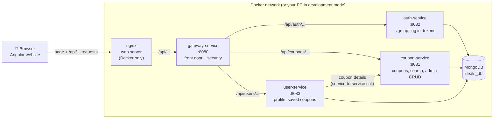
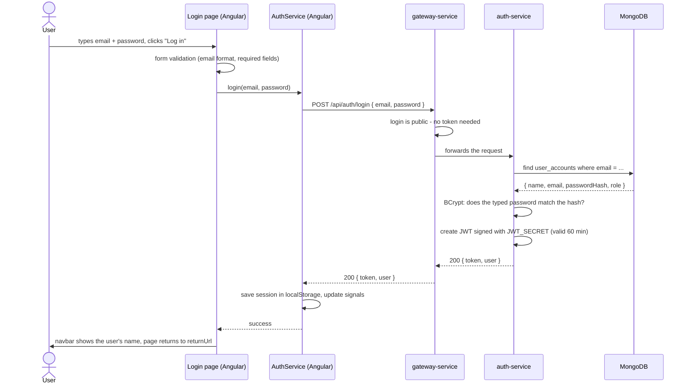
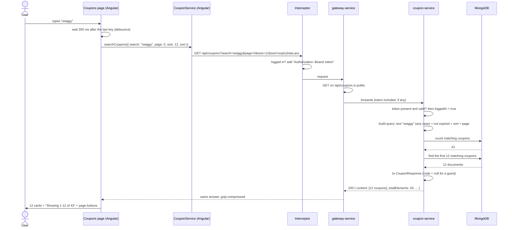
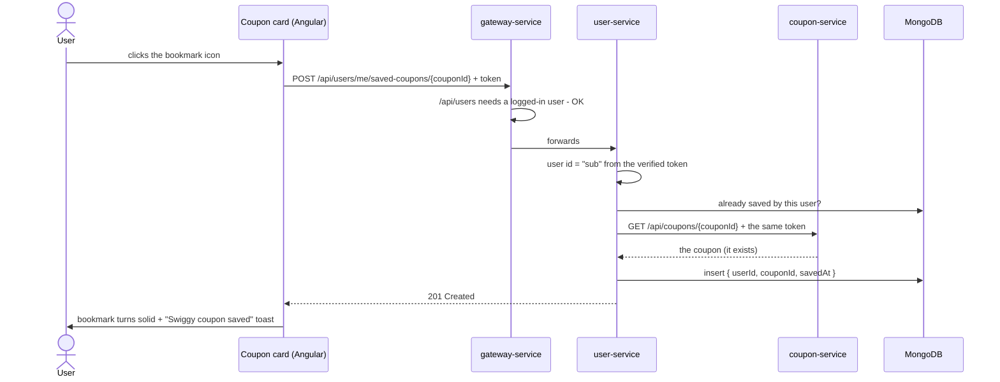
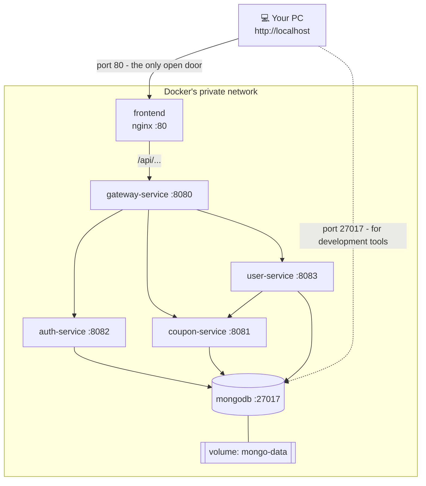
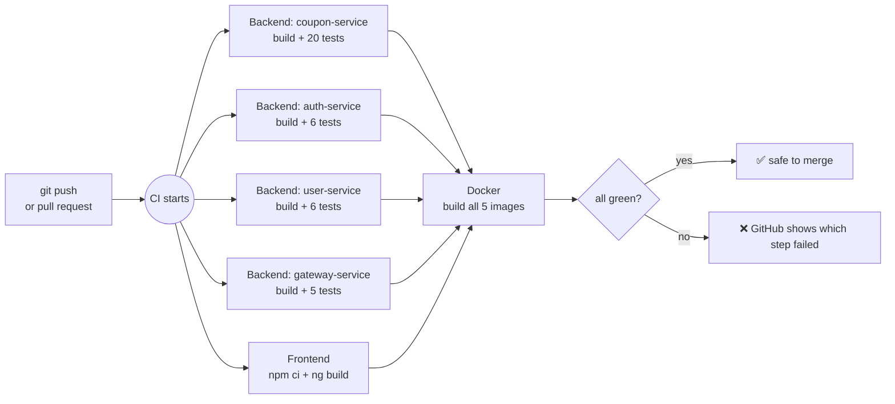

# Deals & Coupons – How It Works

A beginner-friendly guide to the rebuilt Deals & Coupons application: an **Angular** website talking to
**Java Spring Boot microservices**, with **MongoDB**, **Docker** and **GitHub Actions**.

**Who this is for:** you know the basics of web development (HTML, a little JavaScript or TypeScript, what an
HTTP request is), and you want to understand *this* project – what each part does, why it was built that way,
and how to run it.

> **Viewing the diagrams:** they are written in [Mermaid](https://mermaid.js.org/). GitHub draws them
> automatically. In VS Code, install the recommended *Markdown Preview Mermaid Support* extension and open
> this file's preview (`Ctrl+Shift+V`).

---

## Contents

1. [The big picture](#1-the-big-picture)
2. [The building blocks, one by one](#2-the-building-blocks-one-by-one)
3. [What happens when a user does something](#3-what-happens-when-a-user-does-something)
4. [Setting up and running the project](#4-setting-up-and-running-the-project)
5. [Docker: what, why and how](#5-docker-what-why-and-how)
6. [CI/CD with GitHub Actions](#6-cicd-with-github-actions)
7. [Glossary](#7-glossary)
8. [Where to find things in the code](#8-where-to-find-things-in-the-code)

---

## 1. The big picture

### 1.1 What the application does

| Who | What they can do |
|---|---|
| **Guest** | Browse, search, filter and sort every coupon. Sees store, discount, description and expiry date – but the coupon **code is hidden**. |
| **User** (signed up) | Everything a guest can, plus **reveal and copy codes** and **save coupons** for later. |
| **Admin** | Everything a user can, plus **create, edit and delete coupons** in the admin dashboard. |

### 1.2 Old names vs. what exists now

The original 2021 project (kept in `legacy/`) used different names. If you have read the old code or notes,
this table maps them to the rebuild:

| In the old project | In the rebuild | Notes |
|---|---|---|
| "Deals and Coupons" microservice | **coupon-service** | Stores and searches coupons. |
| "Admin" microservice | **coupon-service** (admin endpoints) + **gateway-service** (admin-only rule) + Angular **admin dashboard** | The old admin service only forwarded calls to the coupon service, so it was merged in. |
| LoginService | **auth-service** | Now hashes passwords (the old one stored them as plain numbers). |
| user service + cart | **user-service** (profile + saved coupons) | "Save for later" replaces the unfinished cart. |
| Zuul gateway + Eureka | **gateway-service** | Zuul is retired; Spring Cloud Gateway replaces it. Eureka (service discovery) isn't needed: Docker gives every service a fixed name. |
| Google sign-in | **Not built (yet)** | Users sign up with email + password. See [2.6.1](#261-google-sign-in--not-built-how-it-would-fit) for how Google sign-in would fit. |
| 3 separate Angular 12 apps | **one** Angular 22 app (`frontend/deals-web`) | |

### 1.3 Architecture diagram



- In **Docker mode**, the browser only ever talks to **nginx on port 80**. Everything else is hidden on Docker's private network.
- In **development mode** (running from VS Code), the Angular dev server is on port 4200 and talks to the gateway on port 8080 directly; there is no nginx.

### 1.4 Why microservices – and why these four?

A **microservice** is a small, separate program that does *one job* and has its own data. Instead of one big
application, we have several small ones that talk to each other over HTTP.

**Why split it up?**

| Benefit | In this project |
|---|---|
| **One job each** – easier to understand and change | Changing how passwords work only touches auth-service. |
| **Each service owns its data** | Only auth-service reads `user_accounts`; only coupon-service writes `coupons`. Nobody reaches into another service's tables. |
| **Failures stay contained** | If coupon-service is down, you can still log in, and user-service answers "Coupon service is unavailable" instead of crashing. |
| **Can be deployed and scaled separately** | Coupon browsing gets the most traffic; you could run 3 copies of coupon-service and 1 of the others. |

**Why exactly these four?** Each one matches a clear area of the business:

- **gateway-service** – *the front door.* One address for the website, one place for security rules, so no service has to repeat them.
- **auth-service** – *who are you?* Accounts, passwords, login tokens. Security-sensitive, so it's kept small and separate.
- **coupon-service** – *the product.* Coupons, search, and the admin's create/edit/delete.
- **user-service** – *your stuff.* Things that belong to a logged-in user: profile and saved coupons.

**The trade-off (to be honest):** microservices add moving parts – more programs to start, network calls
between them, more configuration. For a project this size a single application would also work; this project
uses microservices because learning that architecture is one of its goals.

### 1.5 What each folder is for

```
Deals-and-Coupons1.0/
├── backend/                     the four Spring Boot services (Java)
│   ├── gateway-service/
│   ├── auth-service/
│   ├── coupon-service/
│   └── user-service/
├── frontend/deals-web/          the Angular website (TypeScript)
├── docs/GUIDE.md                this guide
├── scripts/seed-coupons.js      adds ~1000 test coupons to MongoDB
├── docker-compose.yml           starts MongoDB – or the whole system
├── .github/workflows/ci.yml     the CI pipeline (GitHub Actions)
├── .env.example                 template for your secrets (copy to .env)
├── .vscode/                     recommended extensions and launch settings for VS Code
└── legacy/                      the original 2021 code, for reference only
```

**Inside every Spring Boot service** the code is split into *layers*. A request travels down through them
and the answer travels back up:

```
src/main/java/com/deals/coupon/
├── controller/   1. receives the HTTP request, sends the HTTP response   (CouponController)
├── service/      2. business rules: "codes are stored in capitals", "no duplicate codes"   (CouponService)
├── repository/   3. talks to MongoDB   (CouponRepository)
├── entity/          what is stored in the database   (Coupon)
├── dto/             what the API receives and sends back   (CouponRequest, CouponResponse)
├── exception/       custom errors + one handler that turns them into JSON error responses
└── config/          settings code: security, clock
src/main/resources/application.yml   port, database address, other settings
src/test/java/...                    automated tests
pom.xml                              the list of libraries (dependencies)
Dockerfile                           how to package this service for Docker
requests.http                        ready-made API calls you can click in VS Code
```

**Inside the Angular app:**

```
frontend/deals-web/src/app/
├── core/          the "engine room" – no visible UI
│   ├── models/        TypeScript shapes of the data (Coupon, User, Page)
│   ├── services/      every HTTP call to the backend lives here
│   ├── interceptors/  adds the login token to every request automatically
│   ├── guards/        decide whether a page may open (logged in? admin?)
│   └── utils/         small helpers (turn server errors into readable messages)
├── shared/        reusable UI pieces: navbar, footer, coupon card, confirm dialog, pipes
├── features/      one folder per page: home, coupons, auth (login/register), saved-coupons, admin, not-found
├── app.routes.ts  which URL shows which page
└── app.config.ts  app-wide setup (router, HTTP client, Material defaults)
```

---

## 2. The building blocks, one by one

Each block answers three questions: **What is it? Why is it here? How does it work?**

### 2.1 Frontend routing (Angular Router)

**What is it?** The part of Angular that decides which page to show for a URL – `/coupons` shows the coupon
list, `/admin` the dashboard – **without reloading the browser**. The whole site is one HTML page (a
*Single-Page Application*); the router swaps the content in the middle.

**Why?** Page changes feel instant, and the header and login state stay in place while you move around.

**How does it work?**
[`app.routes.ts`](../frontend/deals-web/src/app/app.routes.ts) is a list of rules, checked top to bottom:

```ts
{ path: 'coupons', loadComponent: () => import('./features/coupons/coupon-list/coupon-list') ... },
{ path: 'saved', canActivate: [authGuard], ... },   // must be logged in
{ path: 'admin', canActivate: [adminGuard], ... },  // must be an admin
{ path: '**', component: NotFound },               // anything else -> 404 page
```

- **`loadComponent` (lazy loading)** – a page's code is downloaded only when someone first opens it, so the first visit downloads less.
- **Guards** (`authGuard`, `adminGuard`) run *before* a page opens. A guest who opens `/saved` is sent to `/login?returnUrl=/saved`, and comes back after logging in.
- **Important:** guards only improve the experience. Real security is on the server (the gateway), because anyone can change code running in their own browser.

### 2.2 Angular services, HTTP and the interceptor

**What is it?** A *service* is a TypeScript class that does work for pages – here, talking to the backend.
[`CouponService`](../frontend/deals-web/src/app/core/services/coupon-service.ts) has methods like
`searchCoupons()`; pages call them instead of building URLs themselves.

An *interceptor* is a function that sees **every** HTTP request before it leaves.

**Why?** Pages stay simple, and if a URL changes it changes in one place. The interceptor means no page
ever has to remember to attach the login token.

**How does it work?**
- `HttpClient.get(...)` returns an **Observable** – a description of a request that runs when you `subscribe()`.
- [`auth-interceptor.ts`](../frontend/deals-web/src/app/core/interceptors/auth-interceptor.ts) adds
  `Authorization: Bearer <token>` – but only to *our* API, never to other websites. If the server answers
  **401** (token expired or invalid), it logs the user out and sends them to the login page.

### 2.3 State with signals

**What is it?** A **signal** is a value Angular watches: `searchText = signal('')`. When it changes, the parts
of the page that use it update by themselves. `computed()` is a value calculated from other signals.

**Why?** The page always matches the data without manual "refresh the screen" code. For example, the navbar
reads `authService.isLoggedIn()`; the moment you log in, it switches from "Log in / Sign up" to your name.

**How does it work?** Read a signal by calling it (`searchText()`), change it with `.set(...)`. Angular
remembers which parts of the page read which signals and redraws only those.

### 2.4 The look: Angular Material

**What is it?** Google's official component library for Angular: ready-made buttons, cards, form fields,
tables, menus, dialogs, paginator, toasts ("snackbars").

**Why?** Consistent, accessible, professional UI without writing every component by hand.

**How does it work?** Each page imports the pieces it uses (`MatButtonModule`, `MatTableModule`...). Colours
and fonts come from one theme file, [`material-theme.scss`](../frontend/deals-web/src/material-theme.scss);
our own CSS uses the theme's variables (`var(--mat-sys-primary)`), so changing the palette restyles everything.

### 2.5 The API gateway

**What is it?** [`gateway-service`](../backend/gateway-service) – the single entry point for all API calls.

**Why?**
- The website needs to know only **one** address.
- **Security rules live in one place** ([`SecurityConfig.java`](../backend/gateway-service/src/main/java/com/deals/gateway/config/SecurityConfig.java)) instead of being repeated in every service.
- **CORS** (the browser rule about calling another address) is configured once.

**How does it work?**
1. **Routing** ([`application.yml`](../backend/gateway-service/src/main/resources/application.yml)):
   a path starting with `/api/coupons` is forwarded to coupon-service, `/api/auth` to auth-service, `/api/users` to user-service.
2. **Security rules**, checked top to bottom – the first match wins:

   | Request | Rule |
   |---|---|
   | `POST /api/auth/register`, `/api/auth/login` | anyone |
   | `GET /api/coupons/...` | anyone |
   | any other method on `/api/coupons/...` (POST, PUT, DELETE) | **admins only** |
   | everything else (`/api/users/...`, `/api/auth/me`) | any logged-in user |

3. If the token is missing → **401** ("who are you?"). If the role is wrong → **403** ("not allowed").
   The request never reaches the service.

### 2.6 Logging in: auth-service, BCrypt and JWT

**What is it?** [`auth-service`](../backend/auth-service) creates accounts and logs people in.

**Why a separate service?** Password handling is the most security-sensitive code. Keeping it small and
separate makes it easier to get right.

**How does it work?**

- **Passwords are never stored.** On sign-up, the password goes through **BCrypt**, a one-way "hash":
  `password123` → `$2a$10$Ls7Cu...` (60 characters). It can't be turned back into the password. At login,
  BCrypt hashes what you typed the same way and compares. BCrypt adds random "salt", so two users with the
  same password get different hashes, and it is deliberately slow, so guessing millions of passwords is impractical.
- **After login you get a JWT** (JSON Web Token) – think of it as a **signed ID card**:
  ```
  header.payload.signature
  payload = { "sub": "<user id>", "name": "Asha", "email": "...", "role": "USER", "exp": <expiry time> }
  ```
  It is **signed** with a secret (`JWT_SECRET`), so changing even one character breaks the signature.
  It is **not encrypted** – anyone can read it (try [jwt.io](https://jwt.io)) – so it never contains secrets.
  It **expires after 60 minutes**.
- **Every service checks the token itself**, using the same secret. Nobody needs to ask auth-service
  "is this token valid?" – that is what *stateless* means.
- **Roles:** sign-up always creates a `USER`. The first `ADMIN` is created when auth-service starts, from
  `ADMIN_EMAIL` / `ADMIN_PASSWORD` in `.env`.

#### 2.6.1 Google sign-in – not built, how it would fit

The original project planned "log in with Google". The rebuild doesn't include it yet. It would fit like this:

1. The Login page gets a "Sign in with Google" button. Google shows its own login screen and sends the website an **ID token** (a JWT signed by Google).
2. The website sends that ID token to a new endpoint, e.g. `POST /api/auth/google`.
3. auth-service verifies the token with Google's public keys (Spring Security's OAuth2 support does this), finds or creates the account by email, and returns **our own JWT** – exactly like a normal login.
4. From then on, nothing else changes: every other service keeps checking our JWT.

That last point is why the token design matters: adding a new way to log in only touches auth-service.

### 2.7 coupon-service: layers, validation and errors

**What is it?** [`coupon-service`](../backend/coupon-service) – stores coupons and answers every question about them.

**Why layers?** Each layer has one job, so code is easy to find and test:

| Layer | Class | Job |
|---|---|---|
| Controller | [`CouponController`](../backend/coupon-service/src/main/java/com/deals/coupon/controller/CouponController.java) | Turn HTTP into method calls and back. No business logic. |
| Service | [`CouponService`](../backend/coupon-service/src/main/java/com/deals/coupon/service/CouponService.java) | Business rules: codes saved in CAPITALS, no duplicate codes, hide codes from guests. |
| Repository | [`CouponRepository`](../backend/coupon-service/src/main/java/com/deals/coupon/repository/CouponRepository.java) | Read and write MongoDB. |

**How does it work?**
- **DTOs** (Data Transfer Objects) are the shapes the API uses: `CouponRequest` (what an admin sends),
  `CouponResponse` (what everyone receives). They are separate from the database class `Coupon`, so the API
  and the database can change independently, and clients can't set fields they shouldn't (like `id`).
- **Validation:** `@NotBlank`, `@Size`, `@DecimalMax` on `CouponRequest`. Bad input is rejected with
  **400** and a list of field errors before any code runs.
- **Errors:** the service just `throw`s (e.g. `CouponNotFoundException`). One class,
  [`GlobalExceptionHandler`](../backend/coupon-service/src/main/java/com/deals/coupon/exception/GlobalExceptionHandler.java),
  turns each error into a standard JSON response (`ProblemDetail`) with the right status code (404, 409, 400).
- **Dependency injection:** classes don't create each other with `new`. Spring creates them and passes them
  into constructors (`new CouponService(couponRepository, clock)` is done for you). This also makes testing
  easy – a test can pass in a fake repository.

### 2.8 Admin create / edit / delete

**What is it?** The admin dashboard ([`features/admin/`](../frontend/deals-web/src/app/features/admin)):
a searchable, sortable, paged table of all coupons, with a form to create and edit, and a confirmation dialog for delete.

**Why spread over three places?**
- **Angular** shows the screens (and `adminGuard` keeps non-admins away from them).
- **The gateway** enforces the real rule: only a token with `role: ADMIN` may `POST`, `PUT` or `DELETE` coupons.
- **coupon-service** does the work and validates the data.

**How does it work?** The Save button sends `POST /api/coupons` (create) or `PUT /api/coupons/{id}` (edit)
with the form's data as JSON. The interceptor adds the admin's token, the gateway checks the role, and
coupon-service validates and saves. If the code already exists, coupon-service answers **409** and the form
shows "A coupon with code 'SAVE20' already exists".

### 2.9 Search, filters and pagination

**What is it?** Searching by text, filtering by category, sorting, and showing **one page at a time** (12 coupons).

**Why on the server?** With 1000 coupons, sending them all to the browser made the page 80 screens long and
the response 200 KB. Now the database does the filtering and sends back 12 – about 0.6 KB compressed.

**How does it work?**
- The website calls `GET /api/coupons?search=swiggy&category=Food&page=0&size=12&sort=discount,desc`.
- Spring turns `page`, `size` and `sort` into a `Pageable` object automatically (maximum page size: 100).
- [`CouponSearchRepositoryImpl`](../backend/coupon-service/src/main/java/com/deals/coupon/repository/CouponSearchRepositoryImpl.java)
  builds the MongoDB query step by step, adding **only the filters that were given**:
  text search (any case, in store / description / category), category, and "not expired".
- It asks MongoDB twice: *how many match in total?* (for "page 3 of 76") and *give me just this page*.
- The answer is a page object: `{ content: [...12 coupons...], page, size, totalElements, totalPages }`.
- In the browser, typing waits **300 ms** after the last key before searching ("debounce"), so one request is sent instead of one per letter.

### 2.10 Members-only coupon codes

**What is it?** Guests see every coupon, but `code` is `null`; logged-in users get the real code.

**Why on the server?** If the server sent the codes and the website just hid them, anyone could read them in
the browser's developer tools (Network tab). The data must not leave the server.

**How does it work?** coupon-service reads the login token (it blocks nothing – it just wants to know who is asking):

```java
// CouponController
boolean loggedIn = jwt != null;            // jwt is null for a guest
// CouponResponse.from(...)
includeCode ? coupon.getCode() : null
```

On the website, a card whose `code` is `null` shows **"Log in to see code"**. After logging in (or signing up),
the user returns to the page they were on, and the codes are there.

### 2.11 Saving coupons: user-service

**What is it?** [`user-service`](../backend/user-service) – the logged-in user's own data: profile (phone,
city) and saved coupons.

**Why?** It's "my stuff", separate from the shared coupon catalogue. It's also the example of one service
calling another.

**How does it work?**
- Every URL is under `/api/users/me/...`. The user id comes from the **verified token**, never from the URL,
  so nobody can read someone else's data by changing a number in the address.
- A saved coupon stores only **the coupon's id** (`saved_coupons` collection). The details always come fresh
  from coupon-service, which owns them.
- [`CouponClient`](../backend/user-service/src/main/java/com/deals/user/client/CouponClient.java) calls
  coupon-service over HTTP – in **one batch request** for all saved coupons – and **passes on the user's
  token**, so the codes are included.
- If coupon-service is down, user-service answers **503** "Coupon service is unavailable" instead of crashing.
  If an admin deleted a saved coupon, it's simply left out.

### 2.12 The database: MongoDB

**What is it?** MongoDB stores data as JSON-like *documents* in *collections* (instead of rows in tables):

```json
{ "_id": "6ac6...", "code": "SAVE20", "provider": "Amazon", "category": "Electronics",
  "description": "20% off on orders over Rs. 2000", "discount": 20, "expiryDate": "2027-12-31" }
```

**Why MongoDB?** It was the original project's database, and a coupon is naturally one self-contained document.

**How do the services connect?**
- **Spring Data MongoDB:** you write an interface (`CouponRepository extends MongoRepository<Coupon, String>`)
  and Spring writes the code. Methods are generated from their names: `existsByCode(code)` becomes the query
  `{ code: code }`.
- **Connection string** in each `application.yml`:
  ```yaml
  uri: mongodb://${MONGO_ROOT_USERNAME}:${MONGO_ROOT_PASSWORD}@${MONGO_HOST:localhost}:27017/deals_db?authSource=admin
  ```
  `${NAME}` reads a setting from the environment / `.env`. `${MONGO_HOST:localhost}` means "use `MONGO_HOST`
  if set, otherwise `localhost`" – Docker sets it to `mongodb`.
- **Indexes** make lookups fast and enforce rules: unique `code`, unique `email`, one save per user + coupon.

| Collection | Owned by | Holds |
|---|---|---|
| `coupons` | coupon-service | code, provider, category, description, discount, expiryDate |
| `user_accounts` | auth-service | name, email, **passwordHash**, role |
| `user_profiles` | user-service | phone, city |
| `saved_coupons` | user-service | userId, couponId, savedAt |

### 2.13 Dates and time zones

**What is it?** One `Clock` object in coupon-service, set to `Asia/Kolkata`
([`TimeConfig.java`](../backend/coupon-service/src/main/java/com/deals/coupon/config/TimeConfig.java)).

**Why?** "Is this coupon expired?" depends on *today's date*, and today's date depends on the time zone.
Servers and Docker containers usually run in UTC, which is 5½ hours behind India – coupons would expire 5½
hours late. Every "today" in the code asks this one clock.

### 2.14 Automated tests

**What are they?** Code that checks the code. 37 backend tests, in three kinds:

| Kind | Example | Speed |
|---|---|---|
| **Unit tests** – one class, with fake ("mock") dependencies | `CouponServiceTest`: a duplicate code throws an error | milliseconds |
| **Web tests** – the HTTP layer only | `CouponControllerTest`: invalid input returns 400 with field errors | ~1 second |
| **Database tests** – real MongoDB queries, on a separate `deals_test` database | `CouponSearchRepositoryTest`: "expires today" still counts as valid | ~1 second |

**Why?** They catch mistakes before users do – and the CI pipeline ([section 6](#6-cicd-with-github-actions))
runs them automatically on every push.

---

## 3. What happens when a user does something

### 3.1 Logging in



Step by step:

1. **Form check in the browser.** The Login page is a *reactive form*: it won't send an empty or malformed email.
2. **Angular sends the request.** `AuthService.login()` → `HttpClient.post('/api/auth/login', { email, password })`.
3. **Gateway.** Login is on the public list, so it's forwarded to auth-service without a token check.
4. **auth-service** looks up the email in `user_accounts`, then asks BCrypt whether the typed password matches the stored hash.
   - Wrong email **or** wrong password → **401 "Invalid email or password"** (the same message for both, so attackers can't find out which emails exist).
5. **Token.** auth-service creates a JWT containing the user id, name, email and role, signed with `JWT_SECRET`.
6. **Back in Angular.** `AuthService` stores the token in `localStorage` (so a page refresh keeps you logged in) and updates its signals.
7. **Screen updates.** The navbar re-draws itself because it reads those signals; the page goes back to where you were (`returnUrl`).
8. **Every later request** carries `Authorization: Bearer <token>`, added by the interceptor.

### 3.2 Searching coupons



Step by step:

1. **Typing.** Each key updates the `searchText` signal. A 300 ms timer restarts on every key; only when you stop typing is a search sent.
2. **Old requests are cancelled.** If a previous search is still running, it's cancelled, so a slow old answer can't overwrite a newer one.
3. **Building the URL.** `CouponService.searchCoupons()` turns the filters into query parameters, leaving out empty ones.
4. **Interceptor.** Adds the login token if you're logged in.
5. **Gateway.** `GET /api/coupons` is public, so it's forwarded to coupon-service.
6. **coupon-service – controller.** Spring reads `search`, `category`, `includeExpired`, `page`, `size` and `sort` from the URL; `@AuthenticationPrincipal` provides the checked token, or `null` for a guest.
7. **Repository.** Builds the MongoDB query from the filters that were given, counts all matches, then fetches only this page.
8. **Service.** Converts each `Coupon` into a `CouponResponse` – with `code` only for logged-in users – and computes `expired` using the India-time clock.
9. **Response.** A page object as JSON; the gateway compresses it (gzip).
10. **Back in Angular.** The `result` signal is set, and the page re-draws: the cards, the "Showing 1–12 of 43" text and the paginator.

### 3.3 Saving a coupon (one service calling another)



### 3.4 When something goes wrong

| What happened | Status | What the user sees |
|---|---|---|
| Form fields invalid | 400 | the field messages, e.g. "Discount cannot be more than 100" |
| Not logged in / token expired | 401 | sent to the login page (the interceptor does this) |
| Logged in but not allowed (e.g. a USER deleting a coupon) | 403 | "You are not allowed to do this." |
| Coupon doesn't exist | 404 | "Coupon not found with id: ..." |
| Duplicate coupon code / email already registered | 409 | "A coupon with code 'SAVE20' already exists" |
| coupon-service is down (when saving) | 503 | "Coupon service is unavailable, please try again later" |
| Backend not running at all | – | "Cannot reach the server. Is the backend running?" |

---

## 4. Setting up and running the project

### 4.1 Install the tools (once)

| Tool | Why | How |
|---|---|---|
| **Git** | download the code, track changes | [git-scm.com](https://git-scm.com) |
| **VS Code** | the editor | [code.visualstudio.com](https://code.visualstudio.com) |
| **JDK 25** | compile and run the Java services | `winget install EclipseAdoptium.Temurin.25.JDK` |
| **Node.js 24** | run the Angular tools | [nodejs.org](https://nodejs.org) (LTS) |
| **Angular CLI** | the `ng` command | `npm install -g @angular/cli` |
| **Docker Desktop** | runs MongoDB (and optionally everything) | `winget install Docker.DockerDesktop` |

You do **not** need to install Maven: every service includes the *Maven Wrapper* (`mvnw`), which downloads
the right Maven version by itself.

After installing, **close and reopen VS Code**, then check in a terminal:

```powershell
java -version      # 25.x
node -v            # v24.x
ng version         # Angular CLI 22.x
docker --version
```

**Windows tips:**
- **Docker Desktop needs WSL2.** If it says "WSL not installed", run `wsl --install` in an *administrator* PowerShell and restart the PC.
- **"running scripts is disabled on this system"** when running `npm`/`ng` in PowerShell: run once
  `Set-ExecutionPolicy -ExecutionPolicy RemoteSigned -Scope CurrentUser`.

### 4.2 Get the code and open it in VS Code

```powershell
git clone https://github.com/antonychirayil/Deals-and-Coupons1.0.git
cd Deals-and-Coupons1.0
code .
```

When VS Code asks *"This workspace has extension recommendations"*, click **Install All** (Java, Spring Boot,
Angular, Docker, MongoDB, REST Client, Mermaid preview...).

### 4.3 Create your `.env` file (secrets)

```powershell
Copy-Item .env.example .env
```

Open `.env` and set your own values:

```properties
MONGO_ROOT_USERNAME=deals
MONGO_ROOT_PASSWORD=choose-a-password
JWT_SECRET=a-long-random-string-of-at-least-32-characters
ADMIN_EMAIL=admin@deals.local
ADMIN_PASSWORD=choose-an-admin-password
```

`.env` is listed in `.gitignore`, so it is never committed. Every service and Docker read it.

### 4.4 Option A – run everything in Docker (easiest)

```powershell
docker compose --profile app up -d --build
```

Wait for it to finish (the first build takes several minutes), then open **http://localhost**.
Log in as admin with `ADMIN_EMAIL` / `ADMIN_PASSWORD`. To stop: `docker compose --profile app down`.

### 4.5 Option B – development mode (for changing code)

1. **Start MongoDB only:**
   ```powershell
   docker compose up -d
   ```
2. **(Optional) add ~1000 test coupons:**
   ```powershell
   docker cp scripts/seed-coupons.js deals-mongodb:/tmp/seed-coupons.js
   docker exec deals-mongodb mongosh -u <MONGO_ROOT_USERNAME> -p <MONGO_ROOT_PASSWORD> --authenticationDatabase admin deals_db --file /tmp/seed-coupons.js
   ```
3. **Start the four services:** in VS Code open *Run and Debug* (`Ctrl+Shift+D`), choose
   **"All backend services"**, press ▶. Each is ready when its console shows `Started ...Application`.
   (Alternative: the *Spring Boot Dashboard* – select all four → ▶. Or `.\mvnw spring-boot:run` in each service folder.)
4. **Start the website:**
   ```powershell
   cd frontend\deals-web
   npm install     # first time only
   ng serve
   ```
   Open **http://localhost:4200**. Code changes reload automatically.

### 4.6 Check that it works

- Health: http://localhost:8080/actuator/health → `{"status":"UP"}` (development mode)
- Try the API: open `backend/gateway-service/requests.http` and click **Send Request** above each example.
- Browse the database: the MongoDB extension (leaf icon) with
  `mongodb://<user>:<password>@localhost:27017/?authSource=admin`.

### 4.7 Run the tests

```powershell
cd backend\coupon-service
.\mvnw test           # repeat in each service folder; MongoDB must be running
```

### 4.8 Common problems

| Problem | Cause and fix |
|---|---|
| "Port 8080 was already in use" | The service is already running (another terminal, the Dashboard, or Docker mode). Stop the other copy. |
| Website says "Cannot reach the server" | The gateway (or the service behind it) isn't running. Check the health URL. |
| Spring Boot Dashboard shows old apps (`admin`, `cart`...) | VS Code imported `legacy/`. The project's settings exclude it; run *"Java: Clean Java Language Server Workspace"* once. |
| Website looks unstyled after adding a library | `ng serve` reads `angular.json` only when it starts. Stop it (`Ctrl+C`) and run `ng serve` again. |
| A service behaves strangely after a rebuild | Don't run services from a terminal *and* let VS Code build the same project at the same time; use one way. |
| Coupons expire at the wrong time | Containers must run with `-Duser.timezone=Asia/Kolkata` (already in each Dockerfile). |

---

## 5. Docker: what, why and how

### 5.1 What is Docker?

Docker packages a program **together with everything it needs** (Java, settings, files) into an **image**.
Running an image gives a **container** – an isolated mini-computer that runs the same way on every machine.

| Word | Meaning | Here |
|---|---|---|
| **Image** | a packaged, read-only recipe result | `deals-and-coupons10-coupon-service` |
| **Container** | a running copy of an image | `deals-coupon-service` |
| **Dockerfile** | the recipe for building an image | `backend/coupon-service/Dockerfile` |
| **Volume** | storage that survives containers being deleted | `mongo-data` (the database files) |
| **Docker Compose** | starts several containers together from one file | `docker-compose.yml` |

### 5.2 Why this project uses it

1. **MongoDB without installing MongoDB.** `docker compose up -d` starts a ready-made database.
2. **One command for the whole system.** No need to start 4 services, a database and a web server by hand.
3. **"Works on my machine" – on every machine.** The same images run on your PC, a server or the CI pipeline.
4. **Security.** Only the website's port is open; the services can't be reached directly, so nobody can skip the gateway's rules.

### 5.3 How the images are built

Each service's [`Dockerfile`](../backend/coupon-service/Dockerfile) has **two stages**:

```dockerfile
# Stage 1: BUILD – an image with Maven and the full JDK
FROM maven:3.9-eclipse-temurin-25 AS build
COPY pom.xml .
RUN mvn -B -q dependency:go-offline      # download libraries (cached while pom.xml is unchanged)
COPY src ./src
RUN mvn -B -q package -DskipTests        # produce the .jar

# Stage 2: RUN – only the small Java runtime and the .jar
FROM eclipse-temurin:25-jre
COPY --from=build /app/target/*.jar app.jar
ENTRYPOINT ["java", "-Duser.timezone=Asia/Kolkata", "-jar", "app.jar"]
```

- **Two stages** keep the final image small and clean: no Maven, no source code inside.
- **Layer caching:** Docker remembers each step. `pom.xml` is copied *before* the source code, so the slow
  library download is skipped on rebuilds unless the dependencies changed.
- **Time zone flag:** containers default to UTC; dates in MongoDB are stored as India midnight, so the JVM uses India time to read them back correctly.

The website's [`Dockerfile`](../frontend/deals-web/Dockerfile) works the same way: a Node image builds the
Angular app into plain files, and an **nginx** image serves them.

### 5.4 How the containers work together



Key ideas in [`docker-compose.yml`](../docker-compose.yml):

- **Containers find each other by name.** Inside the network, `mongodb`, `coupon-service`, `gateway-service`
  are host names. So Docker passes settings like `MONGO_HOST: mongodb` and
  `COUPON_SERVICE_URL: http://coupon-service:8081`. Outside Docker these settings aren't set, and the
  services fall back to `localhost` – that's how one codebase works in both modes.
- **`ports:`** opens a container to your PC. Only `frontend` (80) and `mongodb` (27017, for development) have it.
- **`env_file: .env`** gives the services your secrets as environment variables.
- **`depends_on` + `healthcheck`** – the services wait until MongoDB answers a ping.
- **Profiles** – the services have `profiles: [app]`, so plain `docker compose up -d` starts only MongoDB
  (for development mode), while `--profile app` starts everything.
- **nginx as a reverse proxy** ([`nginx.conf`](../frontend/deals-web/nginx.conf)): it serves the website and
  forwards every `/api/...` request to the gateway. The browser sees one address, so no CORS setup is needed,
  and it sends unknown paths like `/coupons` to `index.html` so Angular's router can show the page.

### 5.5 Everyday Docker commands

| Command | What it does |
|---|---|
| `docker compose --profile app up -d --build` | build (if needed) and start everything |
| `docker compose --profile app ps` | list containers and their status |
| `docker compose --profile app logs -f coupon-service` | follow one service's log (`Ctrl+C` to stop following) |
| `docker compose --profile app down` | stop and remove the containers – **data stays** in the volume |
| `docker compose down -v` | ⚠️ also deletes the volume – **all data is lost** |

---

## 6. CI/CD with GitHub Actions

### 6.1 What is CI/CD?

- **CI – Continuous Integration:** every time code is pushed, a machine automatically **builds the project
  and runs all tests**. Mistakes are caught within minutes, before anyone else is affected.
- **CD – Continuous Delivery/Deployment:** after CI passes, the project is automatically **packaged and
  released** (for example, Docker images published and a server updated).

This project has **CI** in place. CD is the natural next step (see 6.5).

### 6.2 What our pipeline does

The pipeline is one file: [`.github/workflows/ci.yml`](../.github/workflows/ci.yml). GitHub runs it on every
push to `main` and on every pull request.



| Job | What runs | Why |
|---|---|---|
| **Backend** (4 copies in parallel, one per service – a *matrix*) | Java 25 is installed; a throwaway **MongoDB service container** starts; `./mvnw -B verify` compiles and runs every test | proves each service builds and its tests pass on a clean machine |
| **Frontend** | Node 24; `npm ci` (exact versions from `package-lock.json`); `ng build` | catches TypeScript and template errors |
| **Docker** | `docker compose --profile app build` – runs only if the jobs above passed | proves every Dockerfile still works |

### 6.3 How the workflow file is put together

```yaml
on:
  push:
    branches: [main]      # when to run
  pull_request:

jobs:
  backend:
    runs-on: ubuntu-latest                 # a fresh Linux machine from GitHub
    strategy:
      matrix:
        service: [coupon-service, auth-service, user-service, gateway-service]
    services:
      mongodb:                             # a database just for this job
        image: mongo:8
    env:                                   # test-only values instead of your real .env
      JWT_SECRET: ci-only-secret-that-is-at-least-32-characters-long
    steps:
      - uses: actions/checkout@v7          # download the code
      - uses: actions/setup-java@v6        # install Java 25 (and cache Maven libraries)
      - run: ./mvnw -B verify              # build + test
```

- **Secrets:** CI never sees your `.env`. It uses harmless test values for a database that is deleted when the job ends.
- **Caching:** `setup-java` and `setup-node` keep downloaded libraries between runs, so later runs are faster.
- **A real bug CI caught before it ever ran:** on Windows, git had stored the `mvnw` scripts as *not
  executable*. On GitHub's Linux machines `./mvnw` would have failed with "Permission denied". The fix was
  `git update-index --chmod=+x backend/*/mvnw`. This is exactly the kind of "works on my machine" problem CI exists to find.

### 6.4 Seeing the results

1. Push your code: `git push`.
2. On GitHub, open the repository → **Actions** tab → the latest **CI** run.
3. Each job shows ✅ or ❌; click a job and a step to see its log.
4. The badge at the top of the README shows the latest result.

Optional but recommended: in the repository's **Settings → Branches**, add a rule for `main` that requires
the CI checks to pass before a pull request can be merged.

### 6.5 Next step: CD (not built yet)

A delivery stage would add, after the Docker job:

1. **Publish images** to a registry such as GitHub Container Registry (`ghcr.io`), tagged with the commit.
2. **Deploy:** a server pulls the new images and restarts with `docker compose up -d`.
3. **Production secrets** stored as GitHub *Actions secrets*, never in the code.

---

## 7. Glossary

| Term | Plain meaning |
|---|---|
| **API** | the set of URLs a program offers to other programs |
| **REST** | a style of API using HTTP methods: `GET` read, `POST` create, `PUT` update, `DELETE` remove |
| **JSON** | the text format the API uses: `{ "code": "SAVE20" }` |
| **Microservice** | a small, separate program with one job and its own data |
| **Gateway** | the single front door that forwards requests to the right service |
| **JWT** | a signed "ID card" token proving who you are |
| **BCrypt / hash** | a one-way scramble of a password; can be checked but not reversed |
| **401 / 403** | "I don't know who you are" / "I know you, but you're not allowed" |
| **DTO** | a class describing exactly what an API receives or sends |
| **Dependency injection** | Spring creates objects and hands them to the classes that need them |
| **SPA** | Single-Page Application – one HTML page whose content changes without reloading |
| **Signal** | an Angular value that updates the screen automatically when it changes |
| **Observable** | a description of something that will produce a result later (e.g. an HTTP response) |
| **Interceptor** | code that sees every HTTP request before it leaves |
| **Guard** | code that decides whether a page may open |
| **Pagination** | showing results one page at a time |
| **CORS** | a browser rule: a page may call another address only if that address allows it |
| **Docker image / container** | a packaged program / a running copy of it |
| **Reverse proxy** | a server (nginx) that receives requests and forwards them to the right place |
| **CI / CD** | automatically build and test on every push / automatically release |

---

## 8. Where to find things in the code

| I want to... | Look in |
|---|---|
| change which URL shows which page | [`frontend/deals-web/src/app/app.routes.ts`](../frontend/deals-web/src/app/app.routes.ts) |
| change how a coupon card looks | [`frontend/deals-web/src/app/shared/coupon-card/`](../frontend/deals-web/src/app/shared/coupon-card) |
| add an API call in the website | [`frontend/deals-web/src/app/core/services/`](../frontend/deals-web/src/app/core/services) |
| change the colours | [`frontend/deals-web/src/material-theme.scss`](../frontend/deals-web/src/material-theme.scss) |
| change who may call which API | [`backend/gateway-service/.../config/SecurityConfig.java`](../backend/gateway-service/src/main/java/com/deals/gateway/config/SecurityConfig.java) |
| change login / token behaviour | [`backend/auth-service/.../service/`](../backend/auth-service/src/main/java/com/deals/auth/service) |
| add a coupon business rule | [`backend/coupon-service/.../service/CouponService.java`](../backend/coupon-service/src/main/java/com/deals/coupon/service/CouponService.java) |
| change the search query | [`backend/coupon-service/.../repository/CouponSearchRepositoryImpl.java`](../backend/coupon-service/src/main/java/com/deals/coupon/repository/CouponSearchRepositoryImpl.java) |
| change a port or the database address | each service's `src/main/resources/application.yml` |
| change how the system runs in Docker | [`docker-compose.yml`](../docker-compose.yml), each `Dockerfile`, [`nginx.conf`](../frontend/deals-web/nginx.conf) |
| change the CI pipeline | [`.github/workflows/ci.yml`](../.github/workflows/ci.yml) |
| try the API by hand | each service's `requests.http` |
